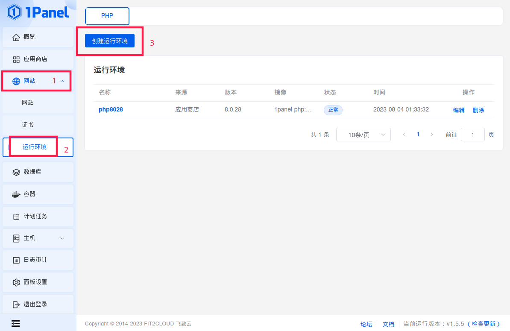
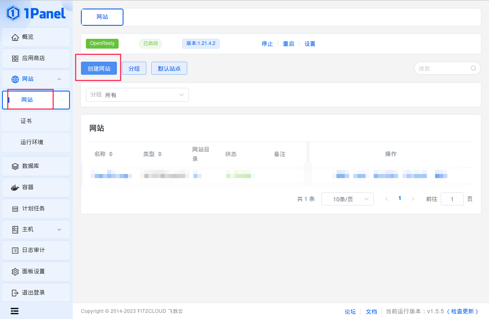
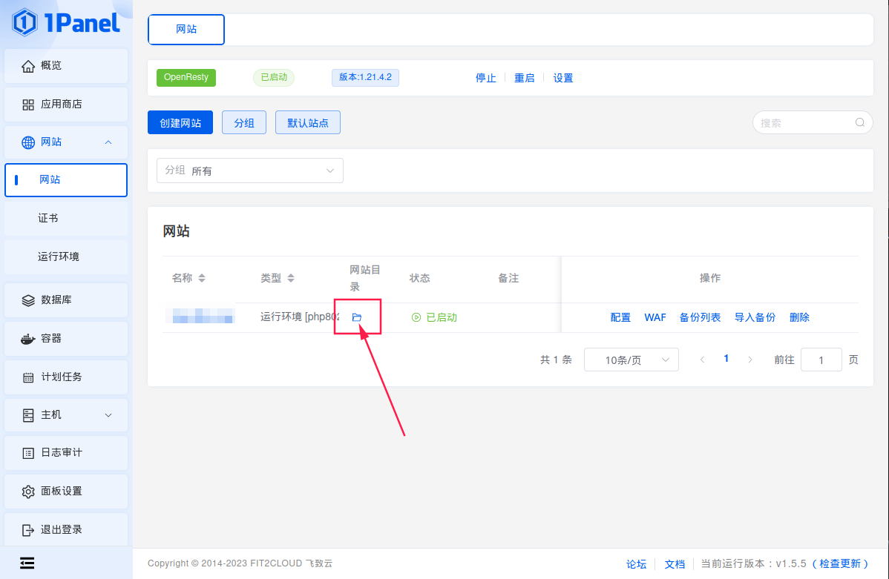
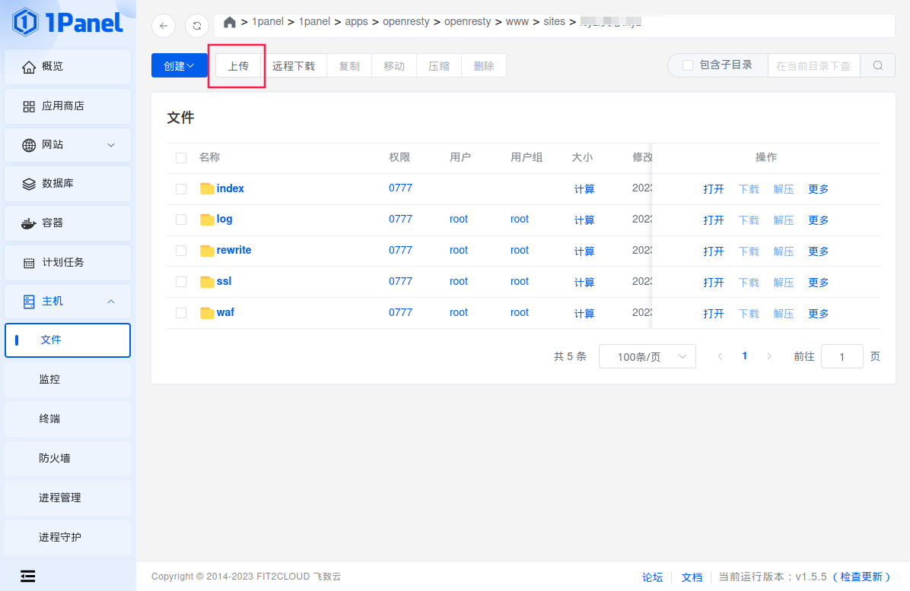
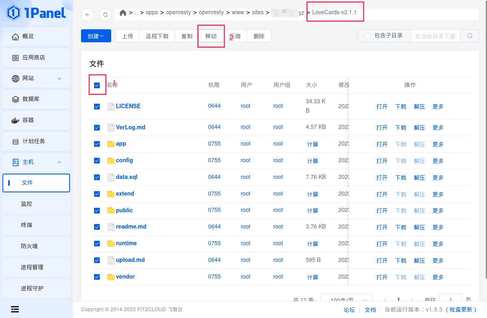
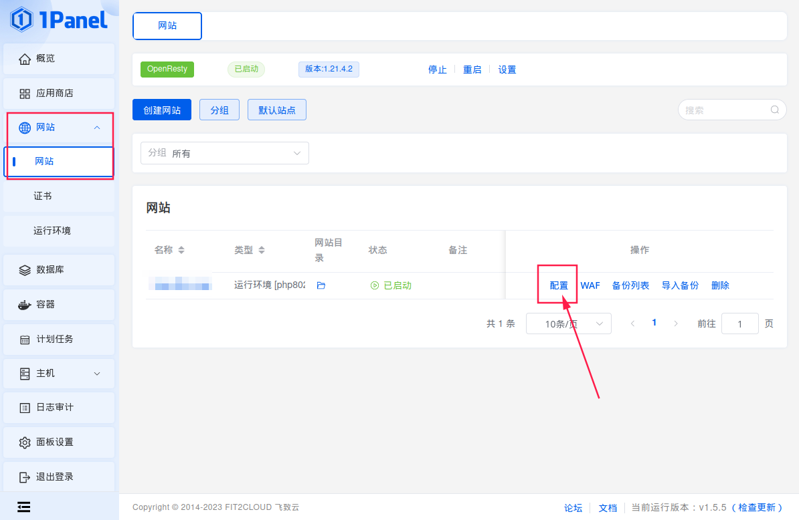
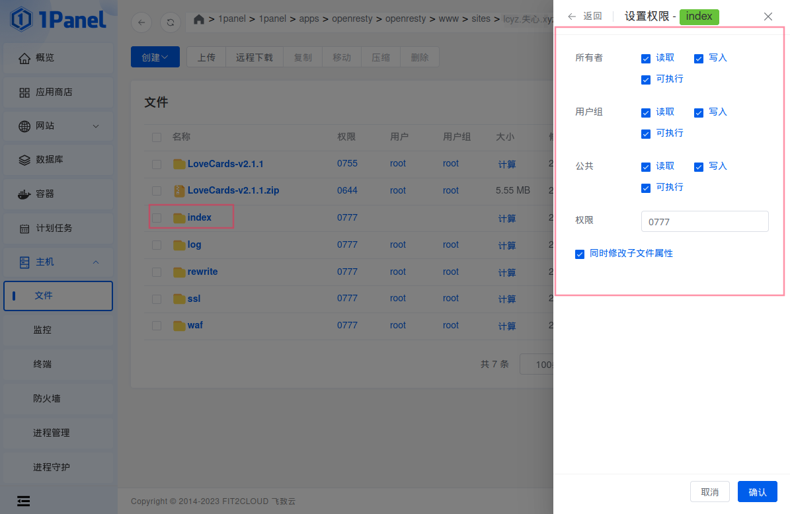
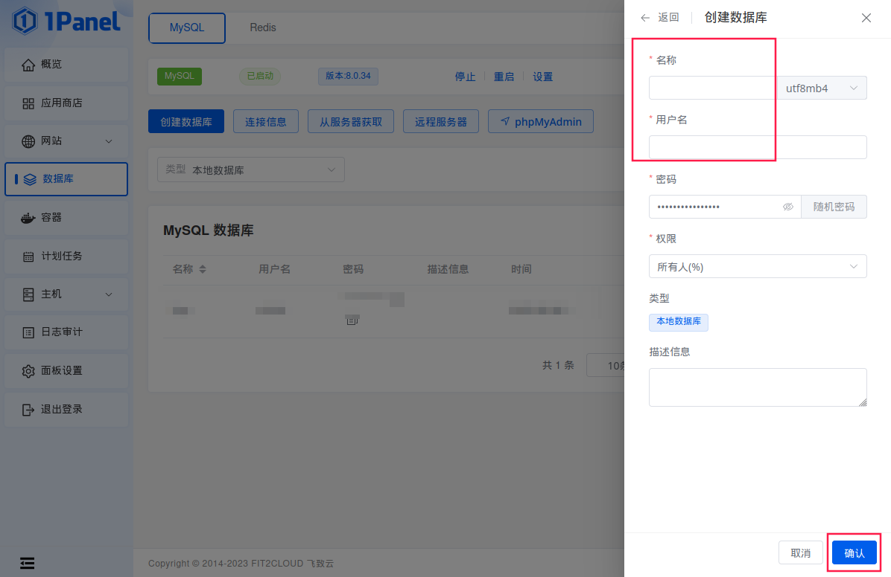
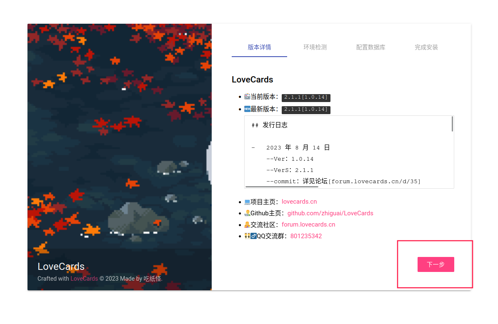

# 1panel 面板部署指南

::: tip 内容源自
作者：shixin  
Email：2936626094@qq.com  
:::

## 准备阶段

> 打开 1panel 面板

### 安装软件

> 点击 _应用商店_ ，找到 _OpenResty_ , _mysql_ ,点进去安装,等待安装完成

### 创建 php 容器

> 找到 _网站_ - _运行环境_ - _创建运行环境_



> 配置与下图一样即可


### 创建网站

> 找到 _网站_ ，点击 _创建网站_



> 在弹出的页面选 _运行环境_ .然后运行环境选刚刚创建的 php8,域名填自己的域名即可


### 上传源码

> 创建好后,点网站目录那个图标,进入网站目录



> 点 _上传_ ,把下载的源码文件上传进去,然后点解压



> 解压完成后进入源码文件夹,全选文件,移动到上图的 index 目录下



### 简单的配置

> 然后再次找到 _网站_
> 点击右面的 _配置_



> 进入到配置页面中
> 点击 _网站目录_
> 运行目录设置成 _public_ 并保存
> 点击 _伪静态_
> 伪静态设置成下面这样并保存

```nginx
location / {
	if (!-e $request_filename){
		rewrite  ^(.*)$  /index.php?s=$1  last;   break;
	}
}
```

> 最后修改 index 目录权限为 0777(勾选同时修改子文件夹)




> 到这里,简单的配置就完成了

### 创建数据库

> 点击 _数据库_ - _创建数据库_




> 名称和用户名自定义 ,填好后点击 _确认_
> 到这里,我们的所有东西就都准备好了

## 安装

> 浏览器打开刚刚创建网站用的域名
> 点击 _下一步_



> _下一步_


> _数据库服务器_ 填 _mysql_
> 其他的根据自己创建的数据库来填
> 填好后点击 _下一步_


> 点击 _进入你的领域！_ 即可食用 lc2


### 后台管理

> 后台管理地址为：你的域名/admin
> 默认帐密：admin
