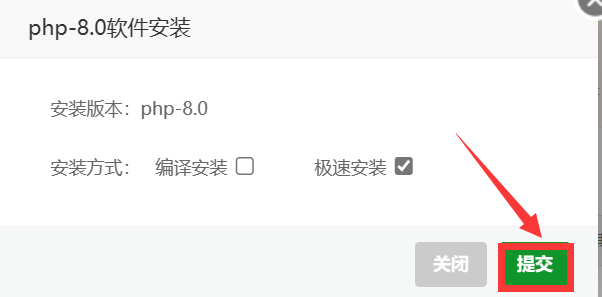
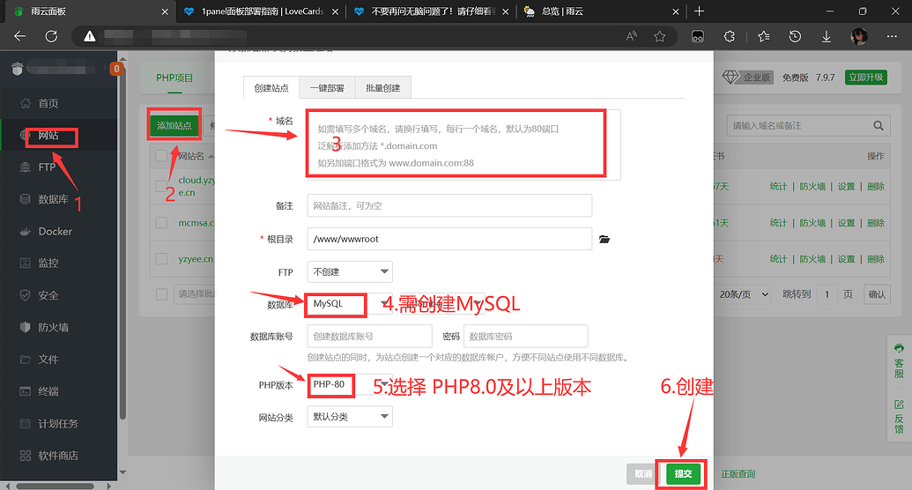
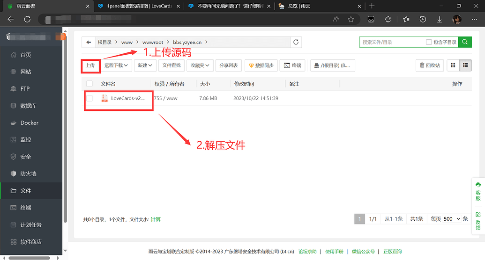
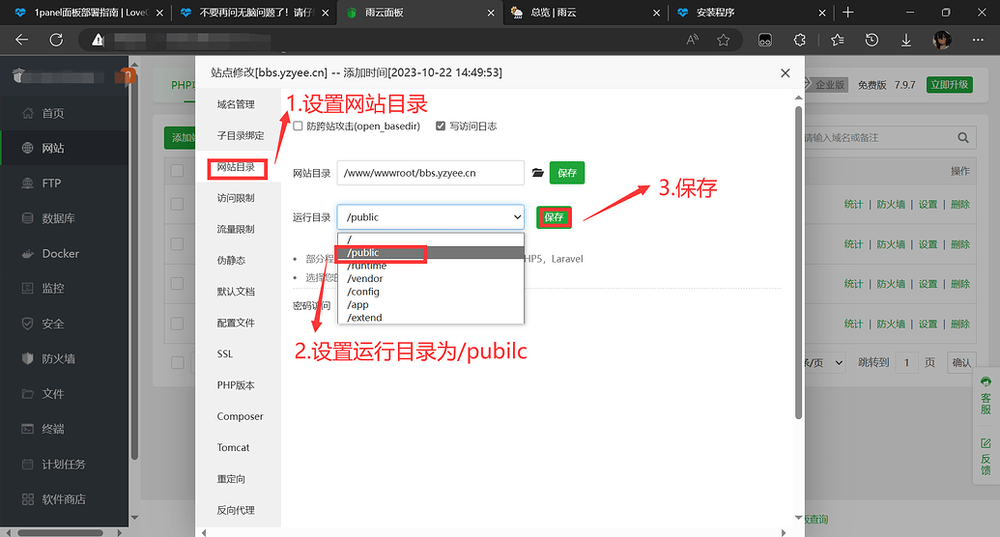
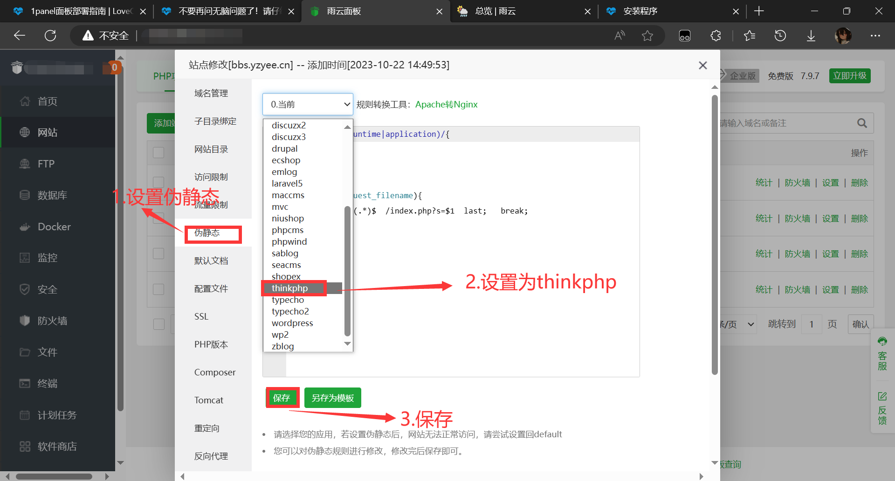
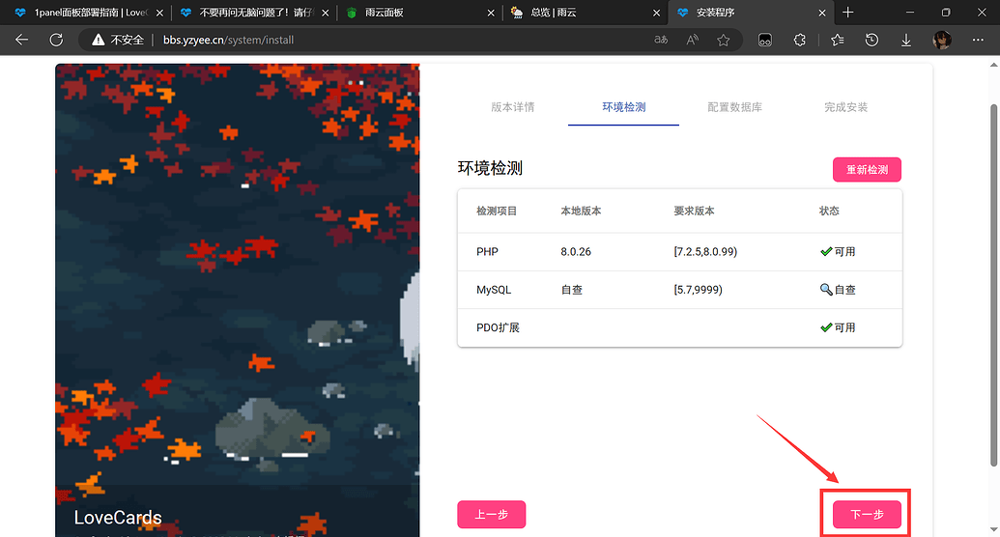
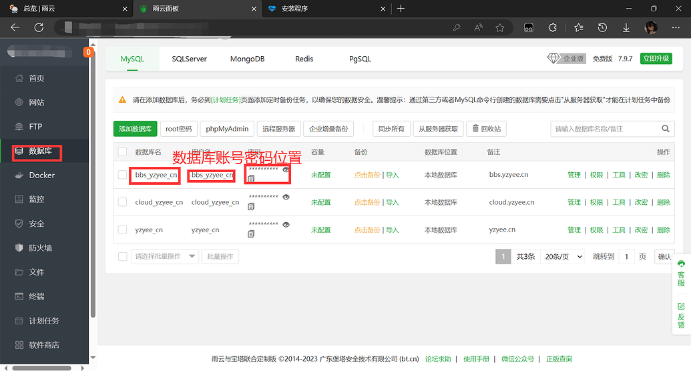

# 宝塔面板部署指南

::: tip 内容源自
作者：NightLamp210  
Email：1828202692@qq.com  
:::

> 本篇教程参考文章：
> [1panel面板部署指南 | LoveCards | 文档](https://docs.lovecards.cn/Docs/V2/QuickStart/1panelDeploymen.html)  
> [不要再问无脑问题了！请仔细看看这些环境配置需求 - LoveCards Forum](https://forum.lovecards.cn/d/34)

> 版权声明：  
> 本文为参考LoveCards文档及论坛文章原创  
> 引用 须标明原文链接  
> 转载 须取得作者授权  

## 一. 购买服务器及进入宝塔面板
略...

## 二. 搭建LoveCards

进入宝塔面板，安装PHP8.0(若已安装可以跳过此步)  

创建站点，注意创建数据库和选择PHP 8.0 版本

进入网站根目录，删除原来所有文件，并上传源码，解压文件  
> 源码下载：[GIthub下载](https://github.com/LoveCards/LoveCardsV2/releases)

对站点进行设置

设置网站目录，更改为/pubilc，注意保存

设置伪静态，设置为thinkphp，注意保存（若没有请自行配置）

## 三.配置LoveCards
登录，进行下一步

环境检测完后，进行下一步

配置数据库，数据库账号，用户名，密码在后图

完成配置，初始账号及密码均为admin

