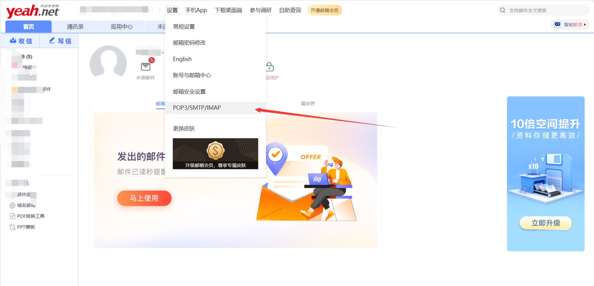
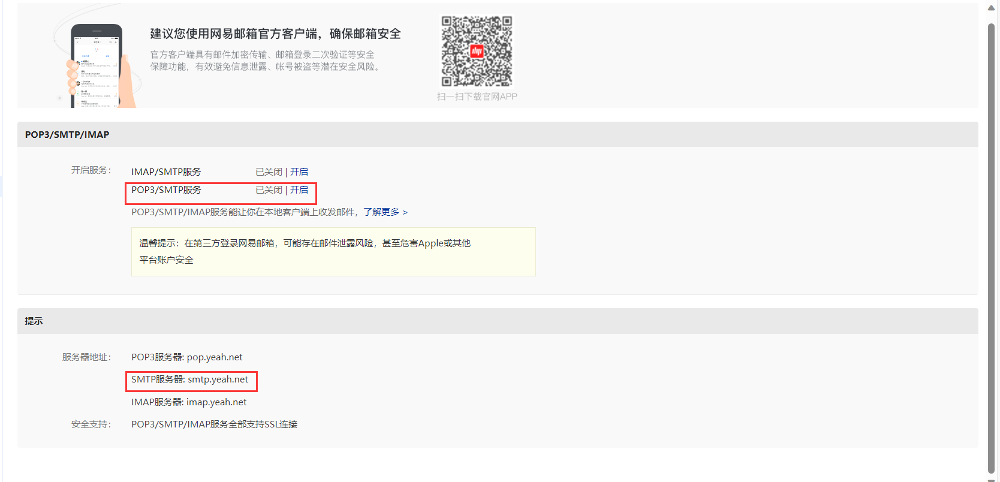
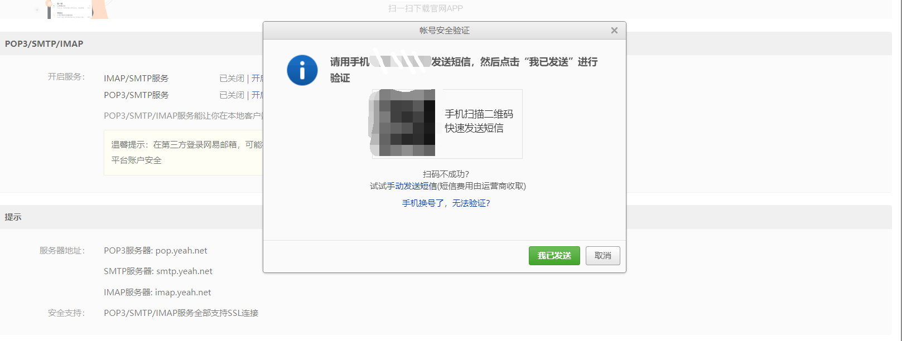
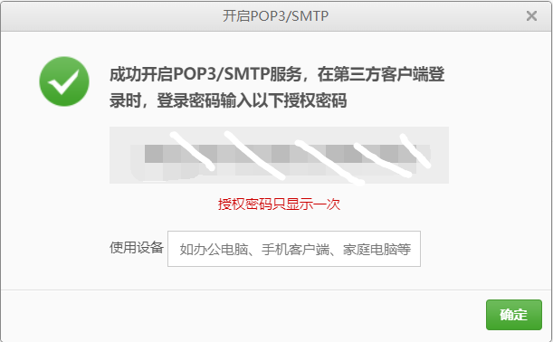
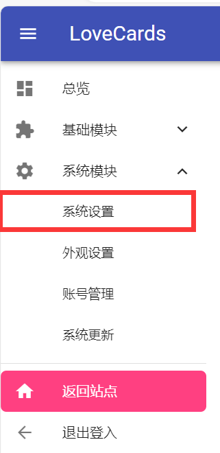
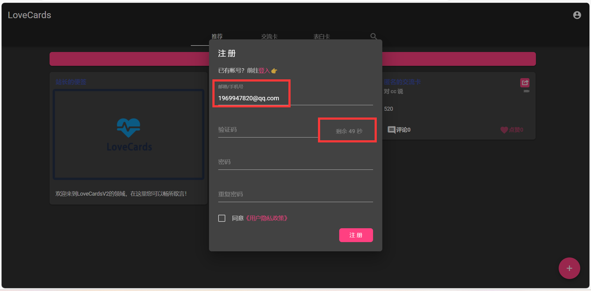
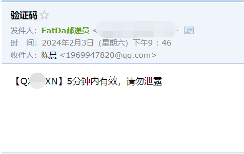

# LC2邮件验证码 设置指南

::: tip 内容源自
作者：Cheney
Email：1969947820@qq.com  
适用版本：V2全版本
:::

## 准备阶段

>准备一个支持SMTP的邮箱，如：QQ邮箱、163邮箱、Gmail等
 
>这里使用网易yeah.net邮箱作为例子

>选择SMTP设置

>打开SMTP服务

)

>大多数邮箱都会验证手机号，所以需要发短信验证

>验证完成后会显示授权码，复制授权码（注意，授权码只显示一次，忘记后需要重新生成）

## 配置阶段

>点击系统模块下的系统设置

>选择邮箱配置

>按照图片进行配置

>如果你的服务器禁用465端口，可以使用25端口

## 验证阶段
>返回主页填写邮箱进行注册

>如果发送成功，说明配置成功

>同时可以查看邮件，查看是否收到邮件

