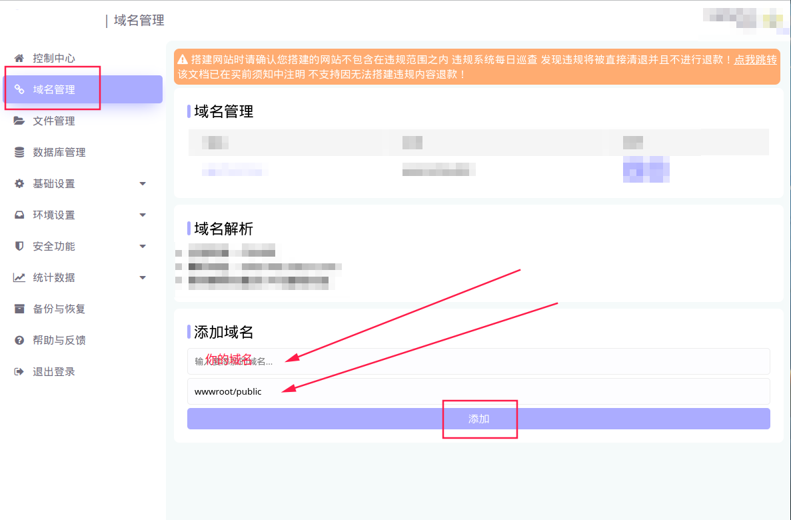
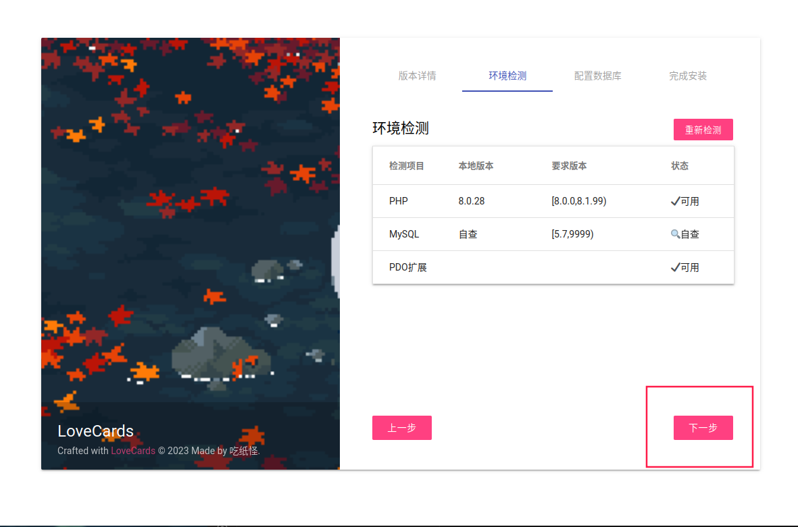

# 虚拟主机 部署指南

::: tip 内容源自
作者：shixin  
Email：2936626094@qq.com  
:::

## 准备阶段

>进入自己的虚拟主机控制中心

### 绑定域名

>点击 _域名管理_ 然后看下图设置

### 上传源码 

>点击 _文件管理_ - _上传_ ,把下载的源码上传进去，然后解压

>解压完成后进入源码文件夹,全选文件,复制到上图的wwwroot目录下

### 简单的配置

>点击 _环境设置_ - _php版本_ 把php版本改成8.0(当前LC版本72|73|74|80皆可，具体可根据LC版本说明设置)

>点击 _伪静态设置_ 把伪静态设置为 thinkphp

>到这里,简单的配置就完成了

## 安装

>浏览器打开刚刚在域名管理里面添加的域名
>点击下一步

>下一步

>查看数据库信息

>_数据库服务器_ 填 _localhost_ 
>其他的根据自己的数据库信息来填
>填好后点击 _下一步_ 

>点击 _进入你的领域！_ 即可食用lc2

### 后台管理

>后台管理地址为：你的域名/admin
>默认帐密：admin